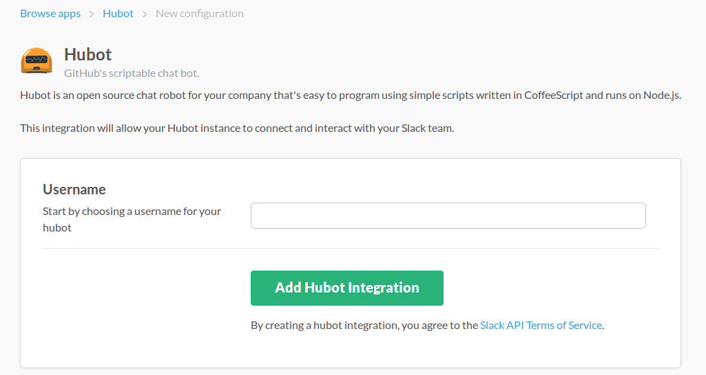
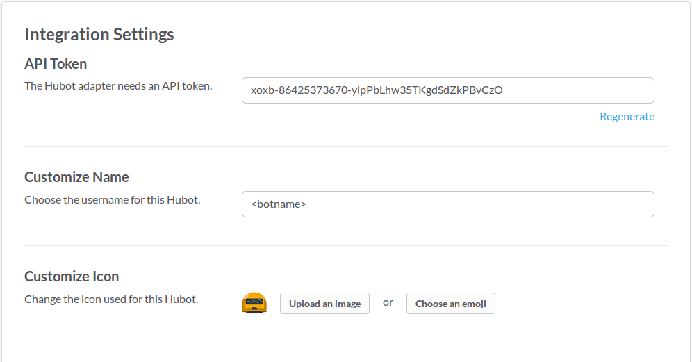

# SlackInspector

This is a slack bot which will add monitoring on the required slack channels and report the messages with details if they are found offensive.

## Overview
This is implemented using 

1. Hubot - a scriptable chat bot
2. MongoDB
3. IBM Watson AlchemyLanguage API

The dashboard is implemented using

1. AngularJs
2. same MongoDB instance

## Installation Details

1. Node 6.x and MongoDB have to be installed.
2. Create a bot integration in Slack web page as mentioned below:


3. Save the integration by filling the details and save the Slack token generated.


4. Run the following commands for building required node modules and starting the bot:
```
npm install
HUBOT_SLACK_TOKEN=xoxb-************-************ ./bin/hubot --adapter slack &
```

5. Add the bot as a normal user in the slack channel where monitoring has to be done.

## Functionality
1. The bot will monitor every message in the channel and checks whether it has any foul words in it. This would be first level of filtering<sup>[1]</sup>.
2. If any bad words are found, then the message will be sent to IBM Watson AlchemyLanguage API to get the emotion levels of the message<sup>[2]</sup>.
3. If the emotion results of Anger/Disgust/Fear turned out to be greater than 30%, then the users in the Slack channel will be notified with a link to report this. (The user will be unaware of the entire process)
4. Upon clicking the link, the report will be submitted. (Stored in MongoDB)

## Admin Dashboard
  Admin can login to a web application to see the submitted reports and other statistics.
  
## User Dashboard
  User can see the usage statistics of the words entered with timely displayed graphs.
  
## References
[1] . Foul Words Dataset - #link#

[2] . IBM Watson Developer Cloud - AlchemyLanguage API - https://www.ibm.com/watson/developercloud/alchemy-language.html
